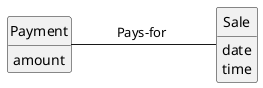
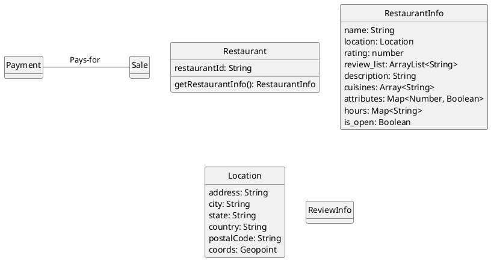

# Design Class Diagram

```plantuml
@startuml
hide circle
hide empty methods
' classes
class Payment{
amount
}
class Sale{
date
time
}
' associations
Payment  -  Sale : \tPays-for\t\t
@enduml
```

```plantuml
@startuml
hide circle
hide empty methods
' classes

class Restaurant{
    restaurantId: String
    --
    getRestaurantInfo(): RestaurantInfo
}

class RestaurantInfo{
    name: String
    location: Location
    rating: number
    review_list: ArrayList<String>
    description: String
    cuisines: Array<String>
    attributes: Map<Number, Boolean>
    hours: Map<String>
    is_open: Boolean
}

class Location{
    address: String
    city: String
    state: String
    country: String
    postalCode: String
    coords: Geopoint
}

class ReviewInfo
' associations
Payment  -  Sale : \tPays-for\t\t
@enduml
```
