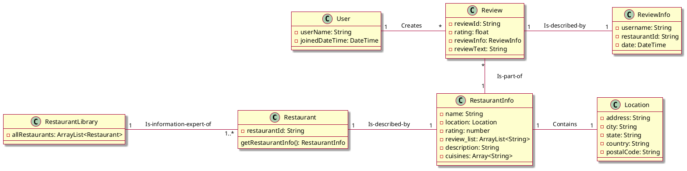

# Sequence Diagram

```plantuml
@startuml
actor User as user
<<<<<<< HEAD
participant " : UI" as ui
=======
participant " : TextUI" as ui
participant " : Controller" as controller
participant " : RestaurantLibrary" as lib

ui -> user : Display search prompt
user -> ui : Enter search term (name)
ui -> controller : search(name)
controller -> lib : results = search(name)
ui -> user : Want price filter?
user -> ui : Enter desired price filter
ui -> user : Want location filter?
user -> ui : Enter desired location filter
ui -> controller : filter(filters)
controller -> IFilter : filteredResults = filter(results, filters)
ui -> user : Which sorting algorithm?
user -> ui : Indicate desired sort
ui -> controller : sortBy(sort)
controller -> lib : sortedResults = sortBy(filteredResults, sort)
controller -> lib : finalResults = toString(sortedResults)
controller -> ui : showResults(finalResults)
>>>>>>> 1fe70e343b7b1c937a6d396b5378341820086cb1

@enduml
```

# Design Class Diagram


