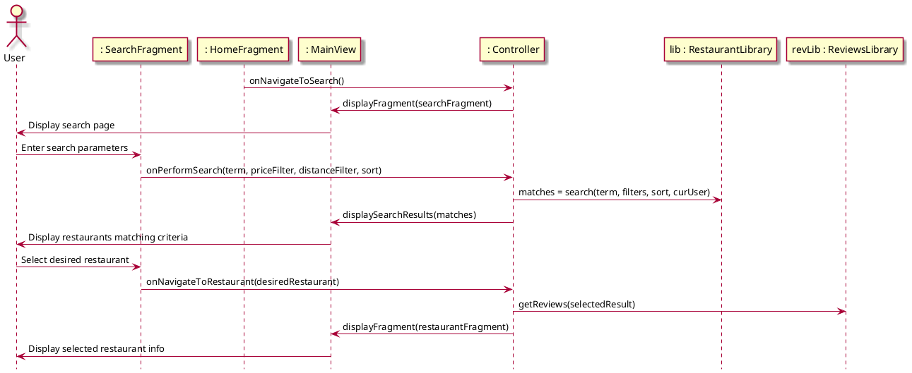
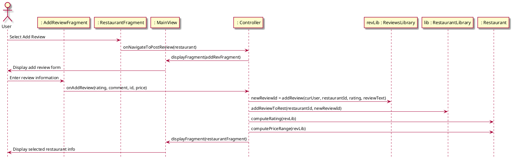
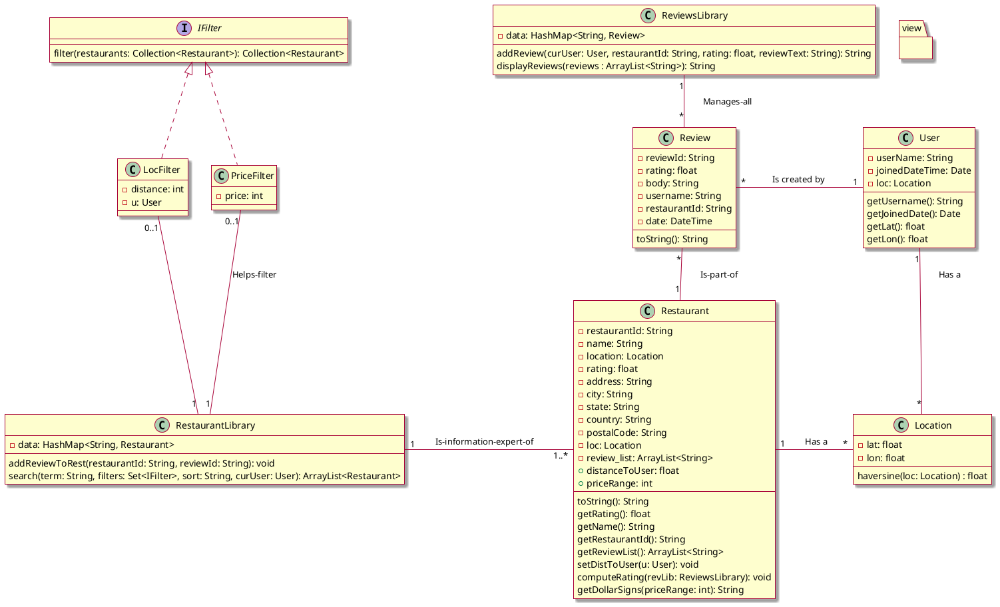

# Sequence Diagrams

## Check Out Restaurant

## Review Restaurant
Picks up directly after Check Out Restaurant:

## Add Restaurant
Picks up directly after "Display restaurants matching criteria" step in Check Out Restaurant:

# Design Class Diagram

