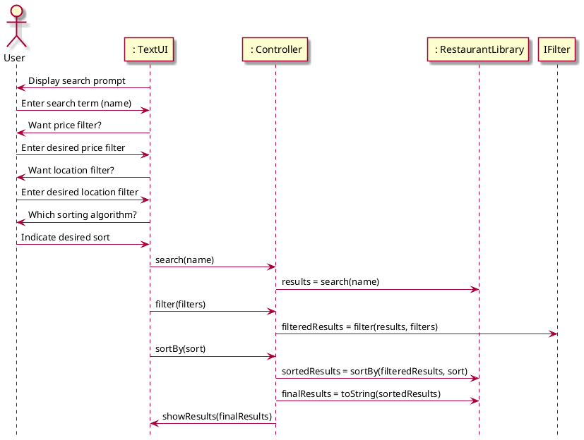
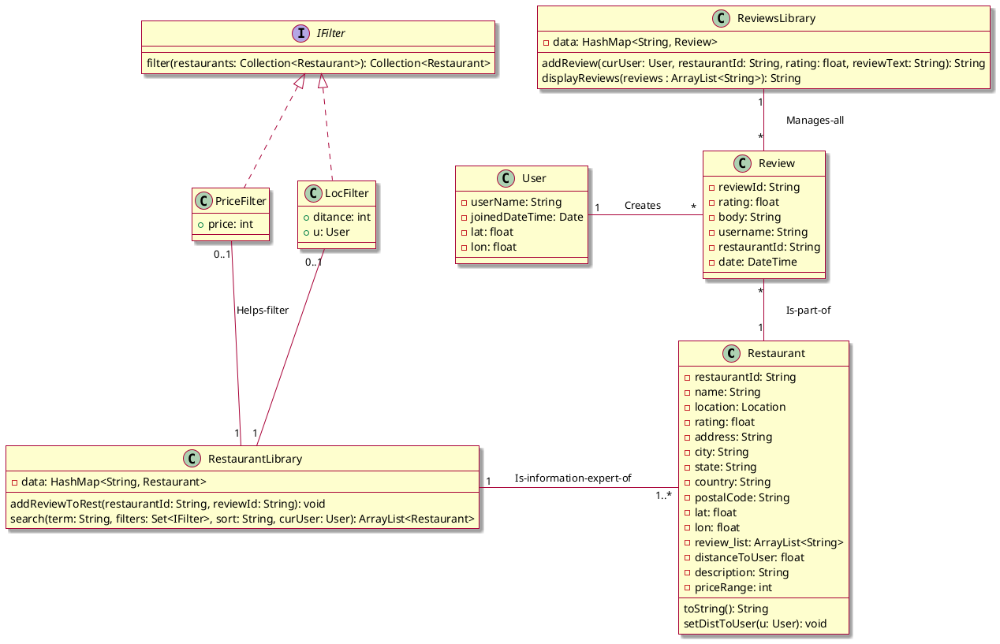

# Sequence Diagram

## Check Out Restaurant

```plantuml
@startuml
hide footbox
skin rose

actor User as user
participant " : TextUI" as ui
participant " : Controller" as controller
participant " : RestaurantLibrary" as lib

ui -> user : Display search prompt
user -> ui : Enter search term (name)
ui -> user : Want price filter?
user -> ui : Enter desired price filter
ui -> user : Want location filter?
user -> ui : Enter desired location filter
ui -> user : Which sorting algorithm?
user -> ui : Indicate desired sort
ui -> controller : search(name)
controller -> lib : results = search(name)
ui -> controller : filter(filters)
controller -> IFilter : filteredResults = filter(results, filters)
ui -> controller : sortBy(sort)
controller -> lib : sortedResults = sortBy(filteredResults, sort)
controller -> lib : finalResults = toString(sortedResults)
controller -> ui : showResults(finalResults)

@enduml
```

## Review Restaurant

# Design Class Diagram

```plantuml
@startuml
skin rose
'skinparam classAttributeIconSize 0

class Restaurant{
    -restaurantId: String
    -name: String
    -location: Location
    -rating: float
    -address: String
    -city: String
    -state: String
    -country: String
    -postalCode: String
    -lat: float
    -lon: float
    -review_list: ArrayList<String>
    -distanceToUser: float
    -description: String
    -priceRange: int
    --
    toString(): String
    setDistToUser(u: User): void
}

class Review{
    -reviewId: String
    -rating: float
    -body: String
    -username: String
    -restaurantId: String
    -date: DateTime
}

class User{
    -userName: String
    -joinedDateTime: Date
    -lat: float
    -lon: float
}

class RestaurantLibrary{
    -data: HashMap<String, Restaurant>
    --
    addReviewToRest(restaurantId: String, reviewId: String): void
    search(term: String, filters: Set<IFilter>, sort: String, curUser: User): ArrayList<Restaurant>
}

class ReviewsLibrary{
    -data: HashMap<String, Review>
    --
    addReview(curUser: User, restaurantId: String, rating: float, reviewText: String): String
    displayReviews(reviews : ArrayList<String>): String
}

interface IFilter { 
    --
    filter(restaurants: Collection<Restaurant>): Collection<Restaurant>
}

class PriceFilter{
    +price: int
}

class LocFilter{
    +ditance: int
    +u: User
}

' associations
IFilter <|.. PriceFilter
IFilter <|.. LocFilter
PriceFilter "0..1" -- "1" RestaurantLibrary: Helps-filter
LocFilter "0..1" -- "1" RestaurantLibrary
RestaurantLibrary "1" - "1..*" Restaurant : \tIs-information-expert-of\t\t
ReviewsLibrary "1" -- "*" Review : \tManages-all\t\t
Review "*" -- "1" Restaurant : \tIs-part-of\t\t
User "1" - "*" Review : \tCreates\t\t
@enduml
```
