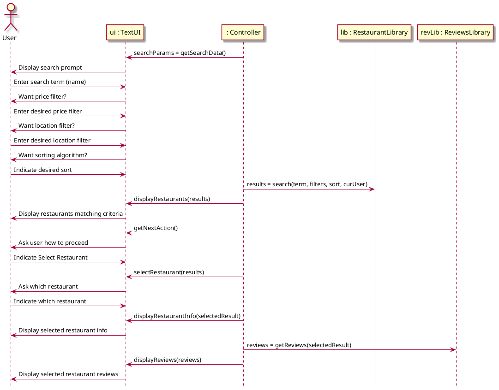
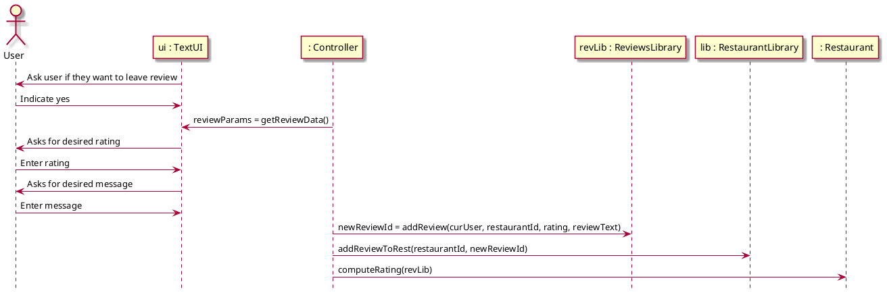
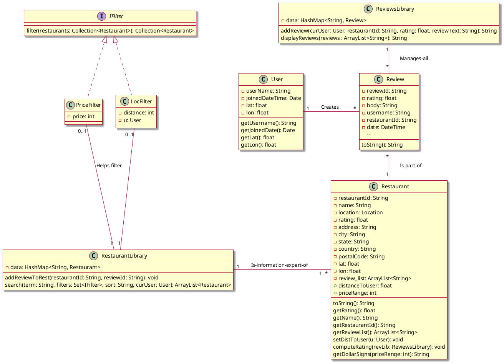

# Sequence Diagram

## Check Out Restaurant

```plantuml
@startuml
hide footbox
skin rose

actor User as user
participant "ui : TextUI" as ui
participant " : Controller" as controller
participant "lib : RestaurantLibrary" as lib
participant "revLib : ReviewsLibrary" as revLib

controller -> ui: searchParams = getSearchData()
ui -> user : Display search prompt
user -> ui : Enter search term (name)
ui -> user : Want price filter?
user -> ui : Enter desired price filter
ui -> user : Want location filter?
user -> ui : Enter desired location filter
ui -> user : Want sorting algorithm?
user -> ui : Indicate desired sort
controller -> lib : results = search(term, filters, sort, curUser)
controller -> ui : displayRestaurants(results)
ui -> user : Display restaurants matching criteria
controller -> ui : getNextAction()
ui -> user : Ask user how to proceed
user -> ui : Indicate Select Restaurant
controller -> ui : selectRestaurant(results)
ui -> user : Ask which restaurant
user -> ui : Indicate which restaurant
controller -> ui : displayRestaurantInfo(selectedResult)
ui -> user : Display selected restaurant info
controller -> revLib : reviews = getReviews(selectedResult)
controller -> ui : displayReviews(reviews)
ui -> user : Display selected restaurant reviews

@enduml
```

## Review Restaurant (picks up directly after Check Out Restaurant)

```plantuml
@startuml
hide footbox
skin rose

actor User as user
participant "ui : TextUI" as ui
participant " : Controller" as controller
participant "revLib : ReviewsLibrary" as revLib
participant "lib : RestaurantLibrary" as lib
participant " : Restaurant" as restaurant

ui -> user : Ask user if they want to leave review
user -> ui : Indicate yes
controller -> ui : reviewParams = getReviewData()
ui -> user : Asks for desired rating
user -> ui : Enter rating
ui -> user : Asks for desired message
user -> ui : Enter message
controller -> revLib : newReviewId = addReview(curUser, restaurantId, rating, reviewText)
controller -> lib : addReviewToRest(restaurantId, newReviewId)
controller -> restaurant: computeRating(revLib)

@enduml
```

# Design Class Diagram

```plantuml
@startuml
skin rose
'skinparam classAttributeIconSize 0

class Restaurant{
    -restaurantId: String
    -name: String
    -location: Location
    -rating: float
    -address: String
    -city: String
    -state: String
    -country: String
    -postalCode: String
    -lat: float
    -lon: float
    -review_list: ArrayList<String>
    +distanceToUser: float
    +priceRange: int
    --
    toString(): String
    getRating(): float
    getName(): String
    getRestaurantId(): String
    getReviewList(): ArrayList<String>
    setDistToUser(u: User): void
    computeRating(revLib: ReviewsLibrary): void
    getDollarSigns(priceRange: int): String
}

class Review{
    -reviewId: String
    -rating: float
    -body: String
    -username: String
    -restaurantId: String
    -date: DateTime
    -- 
    toString(): String
}

class User{
    -userName: String
    -joinedDateTime: Date
    -lat: float
    -lon: float
    --
    getUsername(): String
    getJoinedDate(): Date
    getLat(): float
    getLon(): float
}

class RestaurantLibrary{
    -data: HashMap<String, Restaurant>
    --
    addReviewToRest(restaurantId: String, reviewId: String): void
    search(term: String, filters: Set<IFilter>, sort: String, curUser: User): ArrayList<Restaurant>
}

class ReviewsLibrary{
    -data: HashMap<String, Review>
    --
    addReview(curUser: User, restaurantId: String, rating: float, reviewText: String): String
    displayReviews(reviews : ArrayList<String>): String
}

interface IFilter { 
    --
    filter(restaurants: Collection<Restaurant>): Collection<Restaurant>
}

class PriceFilter{
    -price: int
}

class LocFilter{
    -distance: int
    -u: User
}

' associations
IFilter <|.. PriceFilter
IFilter <|.. LocFilter
PriceFilter "0..1" -- "1" RestaurantLibrary: Helps-filter
LocFilter "0..1" -- "1" RestaurantLibrary
RestaurantLibrary "1" - "1..*" Restaurant : \tIs-information-expert-of\t\t
ReviewsLibrary "1" -- "*" Review : \tManages-all\t\t
Review "*" -- "1" Restaurant : \tIs-part-of\t\t
User "1" - "*" Review : \tCreates\t\t
@enduml
```
