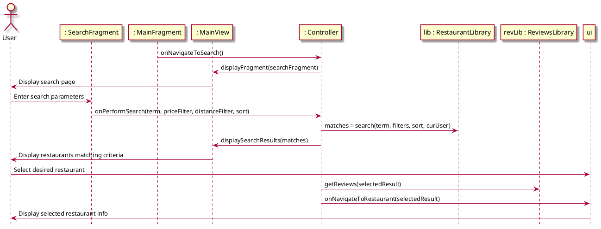
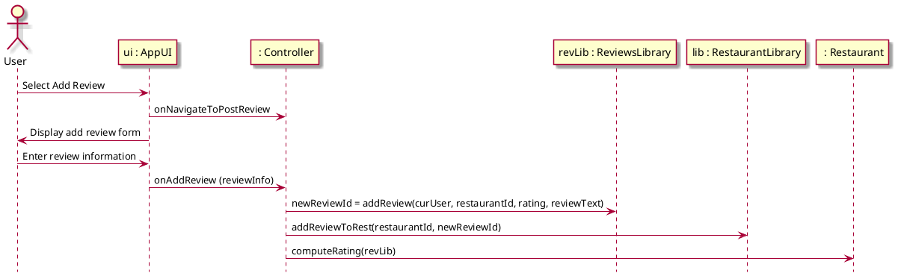

# Sequence Diagrams

## Check Out Restaurant

some fragment is calling on onDoThis. That points to controller. Controller points to mainView using displayFragment

## Review Restaurant
Picks up directly after Check Out Restaurant:

## Add Restaurant
Picks up directly after "Display restaurants matching criteria":

# Design Class Diagram

