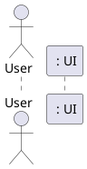
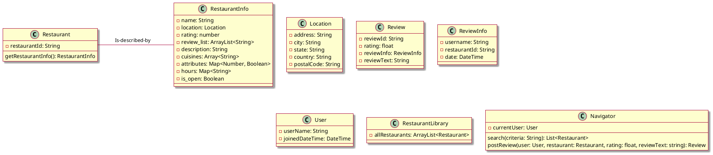

# Sequence Diagram

```plantuml
@startuml
actor User as user
participant " : UI" as ui

@enduml
```

# Design Class Diagram

```plantuml
@startuml
skin rose
'skinparam classAttributeIconSize 0

class Restaurant{
    -restaurantId: String
    --
    getRestaurantInfo(): RestaurantInfo
}

class RestaurantInfo{
    -name: String
    -location: Location
    -rating: number
    -review_list: ArrayList<String>
    -description: String
    -cuisines: Array<String>
    -attributes: Map<Number, Boolean>
    -hours: Map<String>
    -is_open: Boolean
}

class Location{
    -address: String
    -city: String
    -state: String
    -country: String
    -postalCode: String
}

class Review{
    -reviewId: String
    -rating: float
    -reviewInfo: ReviewInfo
    -reviewText: String
}

class ReviewInfo{
    -username: String
    -restaurantId: String
    -date: DateTime
}

class User{
    -userName: String
    -joinedDateTime: DateTime
}

class RestaurantLibrary{
    -allRestaurants: ArrayList<Restaurant>
}

class Navigator{
    -currentUser: User
    --
    search(criteria: String): List<Restaurant>
    postReview(user: User, restaurant: Restaurant, rating: float, reviewText: string): Review
}

' associations
Restaurant  -  RestaurantInfo : \tIs-described-by\t\t
@enduml
```
