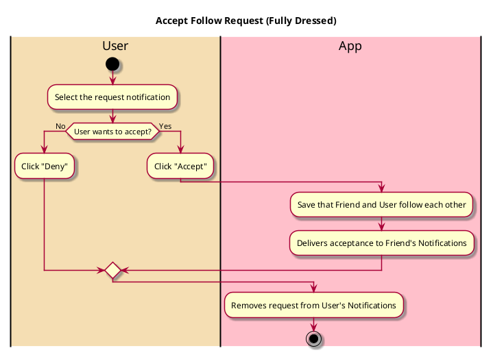

# Accept Follow Request

## 1. Primary actor and goals

* __User__: Wants to connect with people they know. Wants to be able to choose whether or not to be followed by someone.

## 2. Other stakeholders and their goals

* __Friend__: Wants to follow you. Wants user to accept the request.

## 2. Preconditions

* User is logged into a functional account
* User received request in Notifications
* User is currently on their Notifications page

## 4. Postconditions

* Friend is following User and is listed under their Friends
* Friend can see User's reviews, lists, and other account info (and vice versa)

## 4. Workflow

