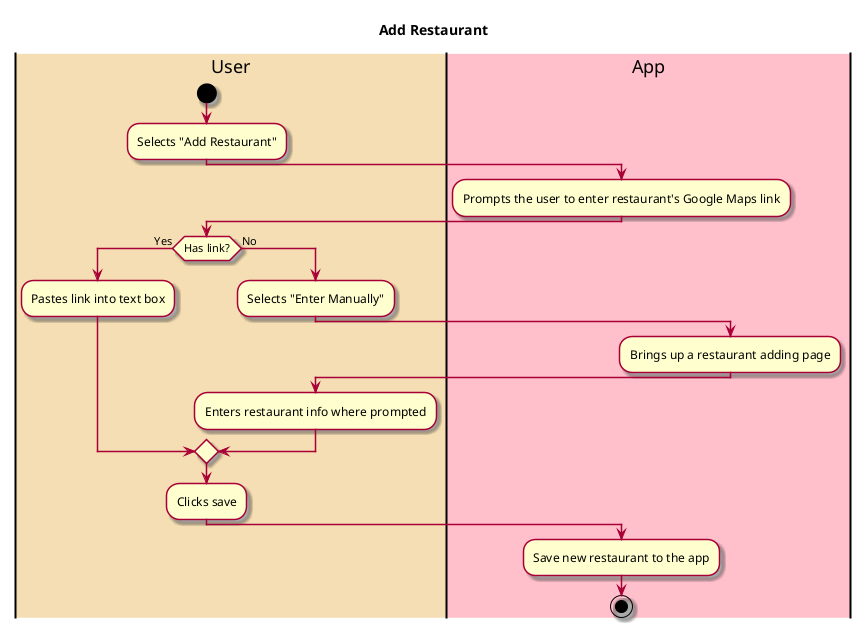

# Add Restaurant

## 1. Primary actor and goals

* __User__: Wants the restaurant they visited to be on the app. Wants them and their friends to be able to view and rate the restaurant.

## 2. Other stakeholders and their goals

* __Restaurant__: Wants to have a profile on the app so their business gets visibility.

## 2. Preconditions

* User is logged into a functional account
* User is on a search results page 

## 4. Postconditions

* Any added restaurant profile is be saved and visible to all viewers when searched

## 4. Workflow

