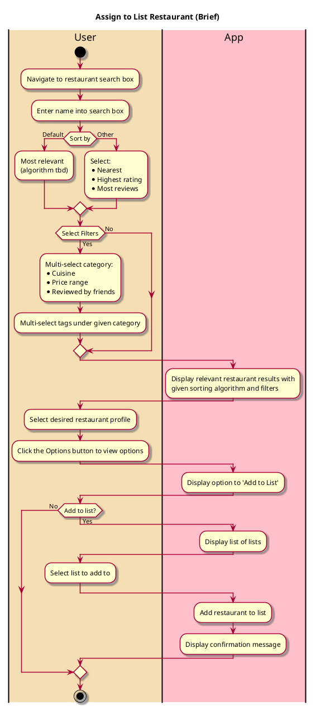

# Assign to List (Brief)

## 1. Primary actor and goals
* __User__: Wants to add a restaurant to a list. Desires an easy-to-use interface and a seamless saving process.

## 2. Other stakeholders and their goals
* __Restaurant Owners__: Seek visibility on the platform and hope to be featured in popular lists. They aim for positive reviews and increased patronage.
* __Friends__: Want to be able to view and interact with the user's list.

## 2. Preconditions
* User is registered and authenticated on the platform.
* The user has one or more existing restaurant lists.
* There is an available database of restaurants that can be searched.

## 4. Postconditions
* The selected restaurant is added to the user's chosen list.

## 5. Workflow

