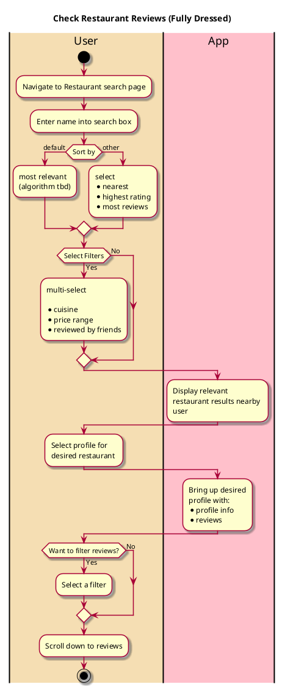

# Check Review

## 1. Primary actor and goals

__User__: Wants to see the rating of a specific restaurant and their friends' reviews of it.

## 2. Other stakeholders and their goals

* __Restaurant__: Wants the user to see positive reviews and have a positive impression of their business.

## 2. Preconditions

* User is logged into a functional account
* Restaurant profile exists and has reviews
* Filters include:
  * Friends only
* Sort by:
  * Most liked (default)
  * Most recent
* 

## 4. Postconditions

* Nothing will be changed on the user's or restaurant's profile

## 4. Workflow

