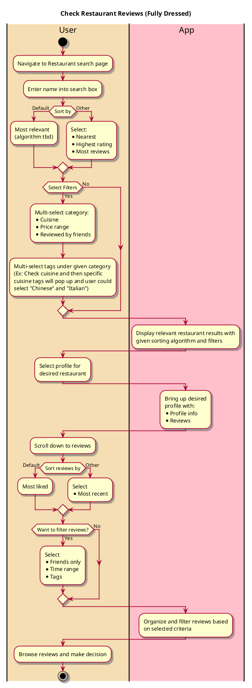

# Check Restaurant Review

## 1. Primary actor and goals

* __User__: Wants to find and view ratings/reviews for a specific restaurant. 
They are particularly interested in feedback from their friends.

## 2. Other stakeholders and their goals

* __Restaurant__: Wants the user to see positive reviews and have a positive impression of their business.
* __Friend__: Wants their reviews to be seen, especially by their friends.

## 2. Preconditions

* User is logged into a functional account
* Restaurant profile exists in the app's database and has reviews (with tags)
* A location is set for the user
  * This can be done automatically using the user's device
  * This can be set or changed manually by the user

## 4. Postconditions

* Nothing will be changed on the user's or restaurant's profile
* User will be able to make an informed decision about whether to visit the restaurant

## 5. Workflow

## Notes
* User has the option to filter restaurant searches:
  * By cuisine
  * By price range
  * By friends
* User has the option to customize sort restaurant searches:
  * By most relevant (default)
  * By nearest
  * By highest rating
  * By most reviews
* User has the option to filter reviews:
  * By friends only
  * By time range
  * By tags
* User has the option to sort reviews:
  * By most liked (default)
  * By most recent