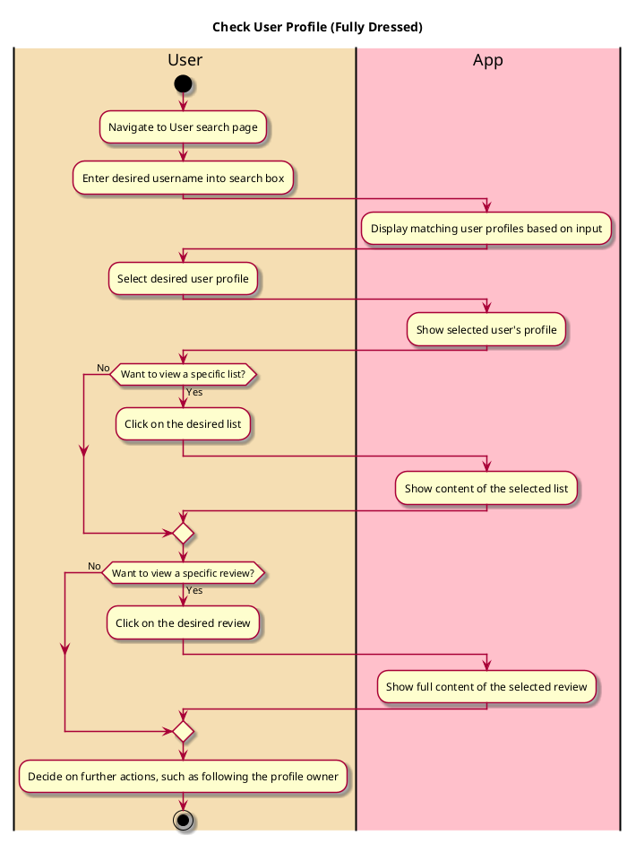

# Check User Profile

## 1. Primary actor and goals
* __User__: Aims to search for and view another user's profile to see their basic info, 
public restaurant lists, and reviews. They're particularly interested in 
connecting with friends and seeing their friends' preferences.

## 2. Other stakeholders and their goals
* __Unfollowed Profile Owner__: Wishes to gain followers or connections, and wants their public lists and reviews to be seen.
* __Followed Friends__: Hope to connect with the user and view shared restaurant interests.

## 2. Preconditions
* User is logged into a functional account
* Searched user's profile exists in the app's database
* User's profile has public lists and reviews visible to other users
* User can search for profiles by username

## 4. Postconditions
* Nothing will be changed on the user's or the searched profile's data
* User can decide to follow or connect with the searched profile based on the information they see

## 5. Workflow

## Notes

A user's profile includes:
* Basic info (e.g. name, profile pic)
* Publicly available restaurant lists
* Reviews