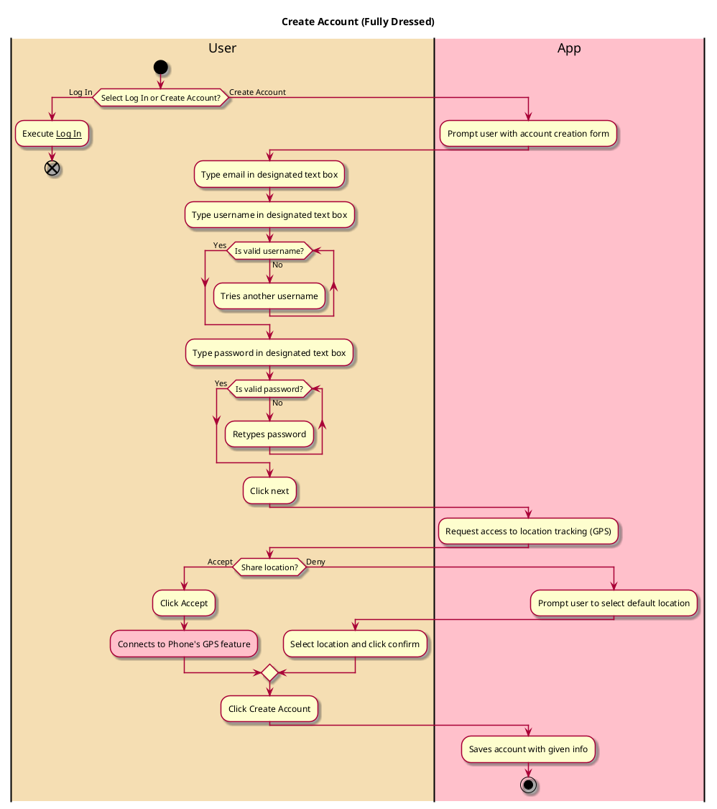
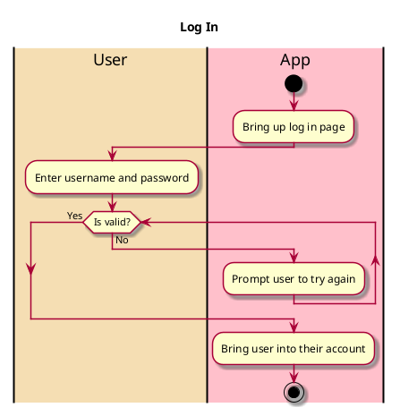

# Create Account

## 1. Primary actor and goals

* __User__: Wants to create an account so they can use the app. Wants their account be accessible to them and only them.

## 2. Other stakeholders and their goals

* __Friend__: Wants to be able to find the user's account using their username so that they can interact.

## 3. Preconditions

* App is downloaded and opened 
* Connection to GPS

## 4. Postconditions

* User is brought to their profile in their logged in account
* Account info is saved under given username
* User can log into their account from another device using username and password
* Account is private and secure

## 4. Workflow

## Notes
* Established Username Requirements:
  * 1-30 characters
  * Only letters, numbers, periods, and underscores
  * Not already taken
* Established Password Requirements:
  * 6-16 characters
  * Only letters, numbers, periods, and underscores

