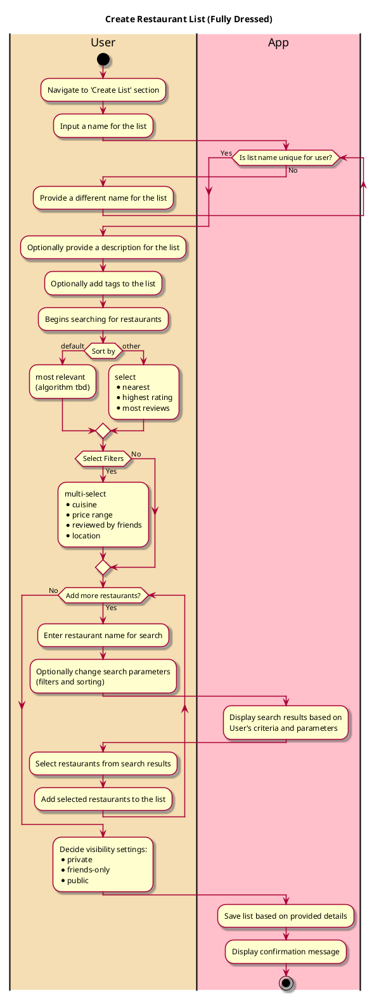

# Create Restaurant List
## 1. Primary actor and goals
   __User__: Wants to curate and save a list of restaurants based on personal criteria (e.g., cuisine, location, wish list). 
   Desires an easy-to-use interface, the ability to search for and add restaurants, and a seamless saving process.

## 2. Other stakeholders and their goals
   __Restaurant Owners__: Seek visibility on the platform and hope to be featured in popular lists. They aim for positive reviews and increased patronage.
   __Friends__: Want to be able to view and interact with the user's list.
## 3. Preconditions
   User is registered and authenticated on the platform.
   There is an available database of restaurants that can be searched and added to the list.
## 4. Post conditions
   New restaurant list is saved under the User's profile.
   The list is available for viewing, editing and is either private or public based on user preferences.
## 5. Workflow
