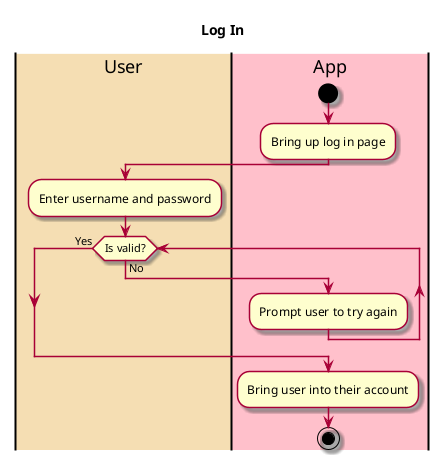

# Login To Account

## 1. Primary actor and goals

* __User__: Wants to access their account so they can use the app.

## 2. Other stakeholders and their goals

* __Friend__: Wants to be able to find the user's account using their username so that they can interact.

## 3. Preconditions

* App is downloaded and opened
* Account exists with known username and password

## 4. Postconditions

* User is brought into the app in their logged in account

## 4. Workflow

