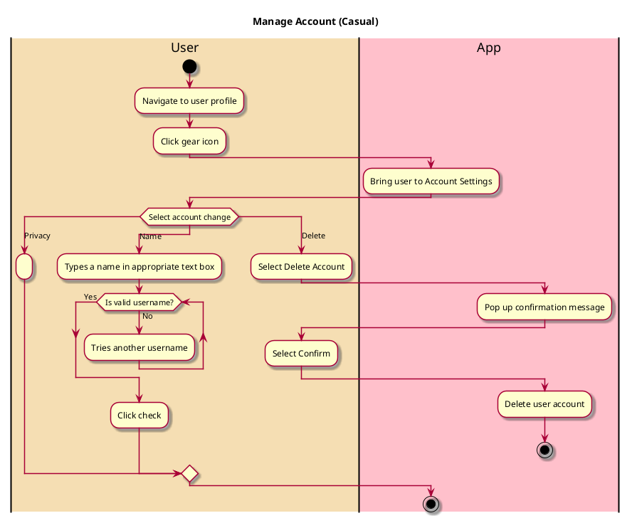

# Manage Account

## 1. Primary actor and goals

__User__: Wants to change their account settings. Wants to change their privacy setting, change their displayed name, or delete their account.

## 2. Other stakeholders and their goals

* None

## 2. Preconditions

* User is logged into a functional account

## 4. Postconditions

* If account is set to private, User activity is only visible to followers.
* If account is set to public, User activity is visible to anyone.
* If name is changed, the new named will be used on profile and all other relevant locations.
* If account is deleted, the account is no longer visible on the app. All of their activity (reviews) are deleted and no longer influence the restaurant's rating.

## 4. Workflow

