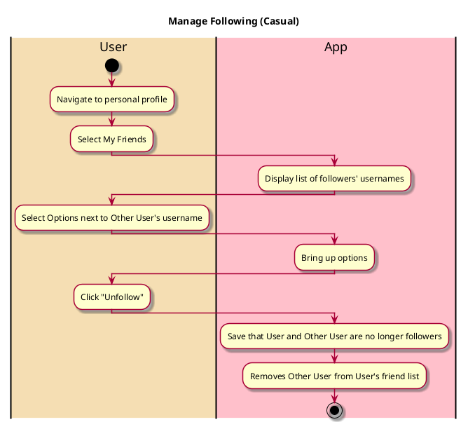

# Manage Following 

## 1. Primary actor and goals

* __User__: Wants to manage who is following them and unfollow people they no longer want to connect with.

## 2. Other stakeholders and their goals

* __Other User__: Wants to connect with others and follow their freinds.

## 2. Preconditions

* User is logged into a functional account
* User is following Other User

## 4. Postconditions

* User and Other User are no longer following each other

## 4. Workflow

