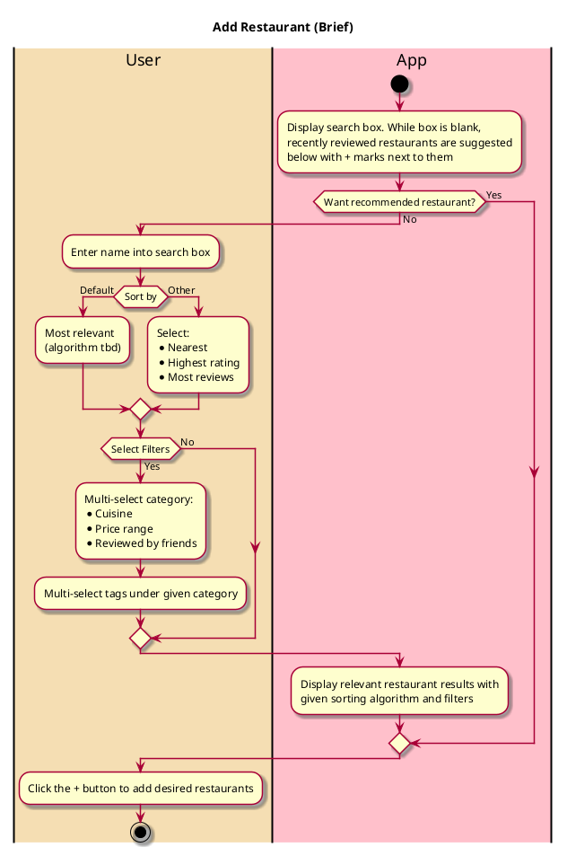

# Manage/Edit Restaurant List
## 1. Primary actor and goals
* __User__: Wants to efficiently manage and organize their restaurant lists. This includes adding new restaurants, removing restaurants, editing list details, and controlling the visibility of their lists.

## 2. Other stakeholders and their goals
* __Restaurant Owners__: Hope to remain featured in popular and frequently viewed lists
* __Friends__: May want to view and interact with the user's restaurant lists, depending on the list's visibility settings.
## 3. Preconditions
* Diner is registered and logged in.
* Diner has already created at least one restaurant list.
## 4. Postconditions
* Modifications to the list are saved.
* The updated list reflects all the diner's changes.
* The list remains available based on its set visibility criteria.

## 5. Workflow
````plantuml
@startuml

skin rose

title Manage Restaurant List (Fully Dressed)

|#wheat|User|
|#pink|App|

|User|
start
:Navigate to 'List' section of User Profile;
|App|
:Display list of user's restaurant lists;
|User|
:Select the restaurant list to manage;

|App|
:Display the selected list with option to edit;

|User|
    :Select an edit action:
    * Edit List Details
    * Add Restaurants
    * Remove Restaurants
    * Change Visibility;

    switch (Action)
        case (Edit List Details)
            |User|
            #pink:Bring up current list info form;
            :Edit the list name and
             description if desired;
            :Update the list privacy setting if desired;
            :Click Save Changes;
            |App|
            :Save list details;
            :Display confirmation message;
            |User|
            :Finishes managing the list;
        case (Add Restaurants)
            |User|
            while (Add more restaurants?) is (Yes)
:Execute __Add restaurant__;
            endwhile (No)
        case (Remove Restaurants)
                |User|
                :Select the restaurants to remove from the list;
                :Click Remove Selected;
                |App|
                :Confirm the removal action;
                :Remove selected restaurants from the list;
                |User|
            :Finishes managing the list;
     endswitch


|User|
:Click Done to finish managing the list;

stop

@enduml  

````

