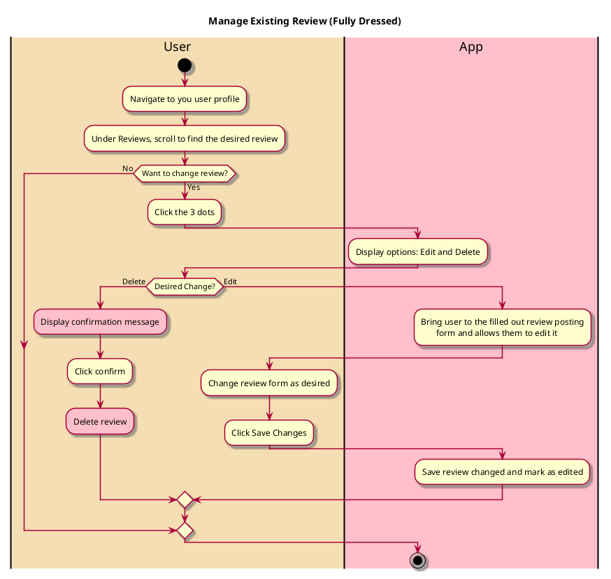

# Manage Existing Review

## 1. Primary actor and goals

* __User__: Wants to edit or delete a review they made. Wants the content they post on the app to be correct and for the process to be flexible.

## 2. Other stakeholders and their goals

* __Friend__: Wants to see their friend's accurate and updated opinions.
* __Restaurant__: Want users to pay attention to their profile and leave positive reviews.

## 3. Preconditions
* User is logged into a functional account
* User has an existing review they posted

## 4. Postconditions
* User's review has been changed in the intended way
* Review is marked as Edited
* If review is deleted, it is no longer visible anywhere and does not affect the restaurant's rating

## 4. Workflow

