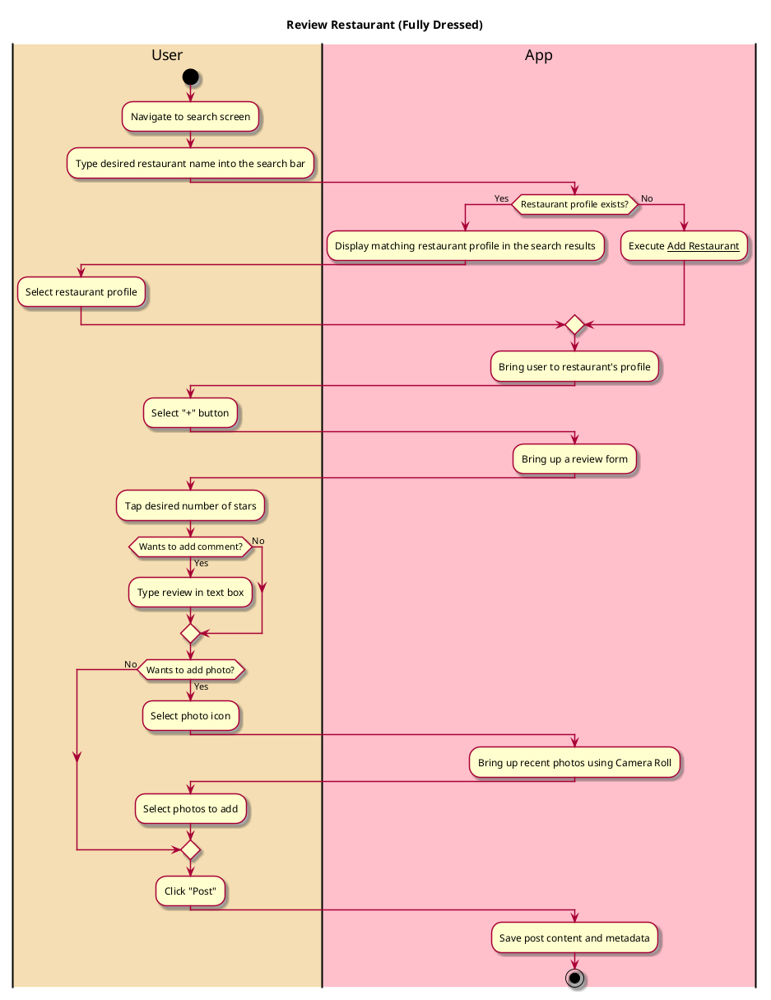
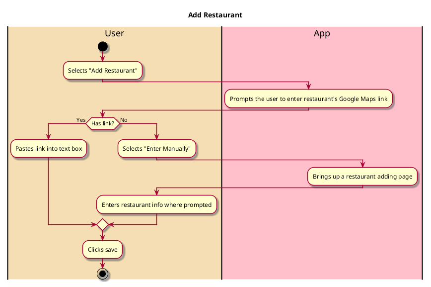

# Post Review

## 1. Primary actor and goals

__User__: wants to leave a rating and written review for a restaurant. Wants to be able to share opinion on the restaurant, and for the review to be saved so it can be displayed on the app.

## 2. Other stakeholders and their goals

* __Restaurant__: Wants to avoid negative and fake reviews to avoid hurting their business.
* __Friend__: Wants to be able to see the user's review when visiting the restaurant's page so they can make an informed decision about whether to eat there.

## 2. Preconditions

* User is logged into a functional account
* App has access to phone's Camera Roll (if photo option is selected)

## 4. Postconditions

* Review (and all its components) is saved
  * Including date, username, and restaurant name
* Review is visible on the user's profile page
* Review is visible on the restaurant's page
* Any added restaurants will be saved and visible to all viewers when searched

## 4. Workflow

