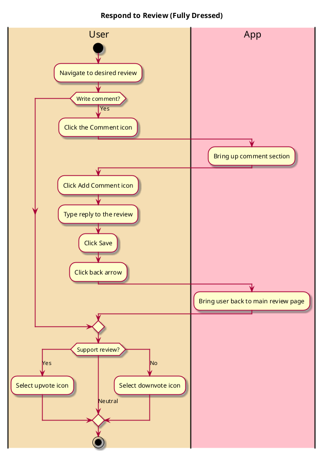

# Respond to Review

## 1. Primary actor and goals

* __User__: Wants to express their opinion on a review.

## 2. Other stakeholders and their goals

* __Friend__: Wants to engage with their friends and share opinions. Wants their reviews to get support.
* __Original poster__: Wants their review to have support.
* __Restaurant__: Wants the user to see positive reviews and have a positive impression of their business.

## 2. Preconditions

* User is logged into a functional account
* There are reviews on the app

## 4. Postconditions

* User's response will be saved and visible to other users

## 4. Workflow

