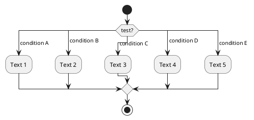

```plantuml

@startuml
start
switch (test?)
case ( condition A )
:Text 1;
case ( condition B )
:Text 2;
case ( condition C )
:Text 3;
case ( condition D )
:Text 4;
case ( condition E )
:Text 5;
endswitch
stop
@enduml
```