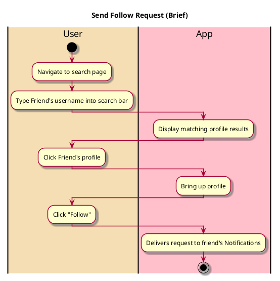

# Send Follow Request

## 1. Primary actor and goals

__User__: Wants to request to follow a profile. Wants to connect with people they know and be able to see their reviews.

## 2. Other stakeholders and their goals

* __Friend__: Wants to choose who to follow and accept to follow them. Wants to expand their network. Wants to know who is trying to follow them.

## 2. Preconditions

* User is logged into a functional account
* User knows the username of their intended friend

## 4. Postconditions

* Request is visible in the friend's Notifications
* Request can be cancelled

## 4. Workflow

