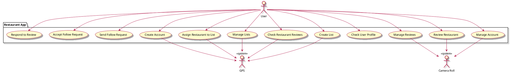

# Vision Document

## Introduction

Our restaurant reviewing app empowers users to track, rate, and share their restaurant experiences while discovering restaurants approved by their trusted circle of friends.

## Target Audience

This app is ideal for food enthusiasts, travelers, social diners, and individuals looking to explore new dining experiences. It is intended for people 13+ years old in the United States.

## Value Proposition
Our app addresses user needs that other reviewing platforms do not:
* Ability to connect with friends and follow their activity
  * Can filter to only reviews of people you know
* Ability to make shareable lists of associated restaurants
* Isolates restaurant reviews from other sorts of establishments, unlike platforms like Yelp and Google Reviews

## Main Features
* Rate and review restaurants
* Connect with friends and view their ratings
* Create and share curated restaurant lists
* Restaurant search with filters
* Trace past visits and experiences

## Constraints

* Dependency on restaurant data accuracy
* Ideal functionality relies on user location
* Maintaining user privacy and data security

## Stakeholder Goals

* For Diners: Find trusted restaurant recommendations, log experiences, and connect with friends.
* For Restaurant Owners: Gain visibility, receive feedback, and attract more patrons.

## UML Use Case Diagram

